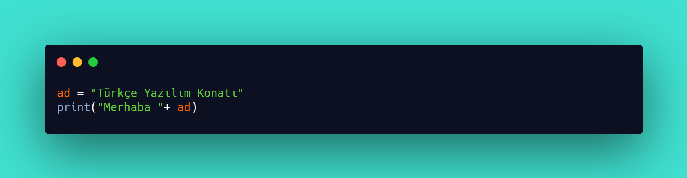

# 🤝 Python İle Tanışın

<figure><figcaption>
Bu bir Python örneÄŸidir.
</figcaption></figure>

Python programlama dilini, bir kez olsun yazılımcılık alanına göz atmış iseniz dirliğinizde[^1] işitmiş görmüş olmanız gerekir. Evet! Programlama dili olan Python oldukça kullanışlıdır, oldukça kolaydır.&#x20;

>  **TÜRKÇE YAZILIM KONATI**
>
> "_Bilgi düzeyiniz ne olur ise olsun, ister çaylak olun ister uzman. Bu kılavuz size göre. Python'u anlattığımız yönleri ile her kişinin tanıyıp çabucak öğrenebileceği, okuyup kolayca anlayabileceği bir kılavuz yazmaktayız._"


"The PEP 8" Yırı


## Programlama Dili Nedir?

Programlama dili denince anlamanızı istediğimiz şudur:&#x20;

> _"Bir bakışta anlaşılamayan yığma yazılar bütünü ile bilgisayara işler yaptırmak."_

Durun durun! Gözünüz korkmasın. Kaygılanmanız yersiz.

Bir programlama dili, sizi donanımlar üstünde bey eder. Atın dizginlerini kavrayan kişinin ata yön vermesi gibidir. Donanımları kullanabilmenize yarar. Bu donanımlar, işlemcilerden bilgisayarlara dek türlü türlü yapılar olabilir. Yeni bilgiler kazandıkça kendinizi bir bey gibi, bir han gibi, bir hanım gibi duyacaksınız.&#x20;

Evet! Programlama dilleri gerçek kişilerin anlayabileceği bir yöntem tabanı üstüne kurulmuştur. Yalnızca yazı yazarak donanımları istenen yolda, istenen biçimde işleyebilmek ve işletebilmek için vardırlar.&#x20;

## Python Programlama Dili Nedir?

Python bir programlama dili olsa dahi türdeşlerin ayrıldığı yanları vardır. Başka programlama dilleri derlenmeye gerek duyar iken Python derlenmeye gerek duymaz. Bu özelliği ile programlama yapan kişiyi bekletmez yavaşlatmaz. Dilin yapısı arı duru olduğu için pek çok kişi başka dillerden yeğ görmektedir. Bunun bir getirisi, yazdığınız programı bir başkası okur okumaz anlayabilir ve tersice.

Python, varlığının taşıdığı tüm özellikleri ile büyük bir ün kazanmıştır. Tanınmış büyük işletmelerce kullanılmaktadır. Günümüzde Türkiye'deki işletmelerde kullanılmaktadır. Türlü eğitim kurumlarında öğretilmektedir.

## Python'u, Guido Van Rossum Var Etti!

<table data-view="cards"><thead><tr><th></th><th></th><th data-hidden data-card-cover data-type="files"></th></tr></thead><tbody><tr><td>1999</td><td>Guido Van Rossum</td><td><a href=".gitbook/assets/Guido Van Rossum - 1999.gif">Guido Van Rossum - 1999.gif</a></td></tr><tr><td>2006</td><td>Guido Van Rossum</td><td><a href=".gitbook/assets/Guido Van Rossum - 2006.jpg">Guido Van Rossum - 2006.jpg</a></td></tr><tr><td>2019</td><td>Guido Van Rossum</td><td><a href=".gitbook/assets/Guido Van Rossum - 2019.jpg">Guido Van Rossum - 2019.jpg</a></td></tr></tbody></table>

| Yüzünü gördüğünüz kişi <mark style="color:purple;">**Guido Van Rossum**</mark>'dur. Python programlama dilini var eden kişidir. Hollanda'lıdır. 1990'larda kolları sıvayıp Python'u var etmeye başlamıştır. Sıra adını koymaya geldiğinde, **The Monty Python** adlı bir İngiliz gülgü toparının **Monty Python’s Flying Circus** adlı gösterisinden esinlenmiştir. Gerçek böyle olsa dahi insanların yılan türü piton ile ilişkilendirilmesine engel olmamıştır. Günümüze dek böylece gelmiştir. |  |
| ------------------------------------------------------------------------------------------------------------------------------------------------------------------------------------------------------------------------------------------------------------------------------------------------------------------------------------------------------------------------------------------------------------------------------------------------------------------------------------------------- | ------------------------------------------------------------------------------------- |

## Çaylak Değil Misiniz?

Kendinizi çaylak sayamayacak düzeyde mi görüyorsunuz? Hiç bunalmayın sıkılmayın. Python programlama dili ile programlama yolculuğuna çıkabilirsiniz.

[Haydi! Python öğrenmeye!](python-ogrenme-kilavuzu/niye-python-oegrenmeliyim.md)

[^1]: 
