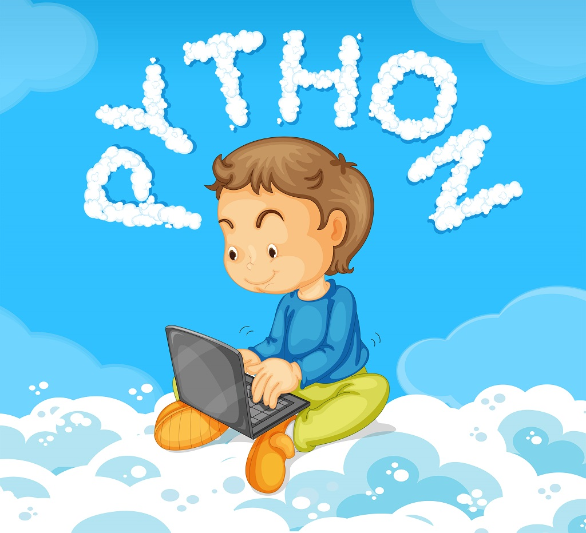
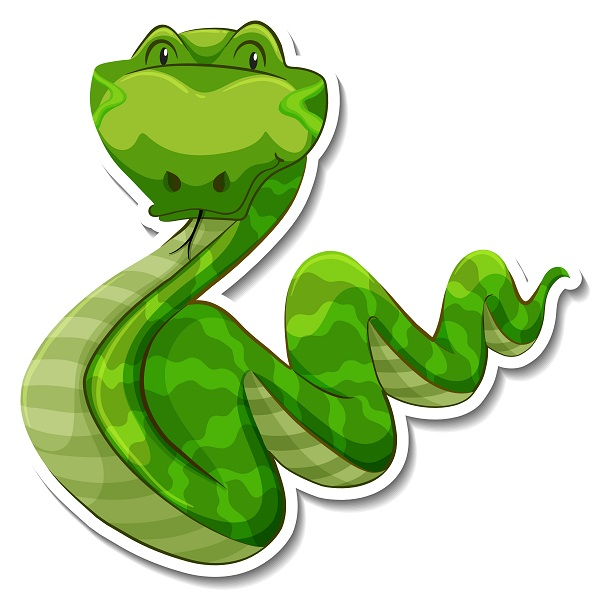

# 🤝 Python İle Tanışın

Dirliğinizde bir kez olsun yazılımcılık alanlarına yakınlaşıp bir programlama diline ilgi duydu iseniz Python adını görmüş işitmiş olmalısınız. Evet! Python bir programlama dilidir. Oldukça kullanışlı bir programlama dili olan Python'u öğrenmek epey kolaydır.

<figure><figcaption>
Python parmaklı çocuk
</figcaption></figure>

Bilgi düzeyiniz az olsun, çok olsun, seçip ayırmadan yazdığımız bu kılavuzda Python'u anlattığımız yönleri ile tanıyacaksınız. Çaylak biri iseniz çaylaklığı geride bırakacağınız günlerin ırakta olmadığını kulağınıza fısıldayabiliriz. :shushing\_face:

## Python Programlama Dili Nedir?

Programlama dili denince gözünüzde düşlemenizi istediğimiz şudur: "_Bir bakışta anlaşılamayan yığma yazılar bütünü._". Gözünüz korkmasın. Yoksa kaygılandınız mı? Öyle ise bu yersiz kaygılanma olur idi.

Programlama dili, işlemcilerden bilgisayarlara dek benzer olan bütün donanımlar üstünde size beylik kurduran bir yöntemdir. Bilginize bağlı bir ölçüde odaklandığınız donanımlar üstünde bir bey gibi olacaksınız, bir han gibi olacaksınız, bir hanım gibi olacaksınız.&#x20;

Evet! Programlama dilleri gerçek kişilerin anlayabileceği bir yöntem tabanı üstüne kurulmuştur. Yalnızca yazı yazarak donanımları istenen yolda, istenen biçimde işleyebilmek ve işletebilmek için vardırlar. 🎶 dinliyoruz.


"The PEP 8" Yırı


## Guido Van Rossum Var Etti!

<table data-view="cards"><thead><tr><th></th><th></th><th data-hidden data-card-cover data-type="files"></th></tr></thead><tbody><tr><td>1999</td><td>Guido Van Rossum</td><td><a href=".gitbook/assets/Guido Van Rossum - 1999.gif">Guido Van Rossum - 1999.gif</a></td></tr><tr><td>2006</td><td>Guido Van Rossum</td><td><a href=".gitbook/assets/Guido Van Rossum - 2006.jpg">Guido Van Rossum - 2006.jpg</a></td></tr><tr><td>2019</td><td>Guido Van Rossum</td><td><a href=".gitbook/assets/Guido Van Rossum - 2019.jpg">Guido Van Rossum - 2019.jpg</a></td></tr></tbody></table>

Gördüğünüz kişi <mark style="color:purple;">**Guido Van Rossum,**</mark> Python programlama dilini var eden kişidir. Hollanda'lıdır. 1990'larda var etmeye başlamıştır. Adını koyar iken ise **The Monty Python** adlı bir İngiliz gülgü toparının **Monty Python’s Flying Circus** adlı gösterisinden esinlenmiştir. Acı gerçek böyle olsa dahi yılan türü piton ile ilişkilendirilmesine engel olmamıştır. Günümüze dek böylece gelmiştir.

<figure><figcaption></figcaption></figure>

## Çaylak Değil Misiniz?

Kendinizi çaylak diyemeyecek ölçüde bilgisiz mi görüyorsunuz? Hiç bunalmayın sıkılmayın. Python programlama dili ile programlama yapma yolculuğuna başlayabilirsiniz.

Python bir programlama dili olsa bile türdeşlerin ayrıldığı yanları vardır. Başka programlama dilleri derlenmeye gerek duyar iken Python derlenmeye gerek duymaz. Bu özelliği ile programlama yapan kişiyi bekletmez yavaşlatmaz. Dilin yapısı arı duru olduğu için pek çok kişi başka dillerden yeğ görmektedir. Bunun bir getirisi, yazdığınız programı bir başkası okur okumaz anlayabilir ve tersice.

Python, varlığının taşıdığı tüm özellikleri ile büyük bir ün kazanmıştır. Tanınmış büyük işletmelerce kullanılmaktadır. Günümüzde Türkiye'deki işletmelerde kullanılmaktadır. Türlü eğitim kurumlarında öğretilmektedir.

[Haydi! Python öğrenmeye!](python-ogrenme-kilavuzu/neden-python-oegrenmeliyim.md)

