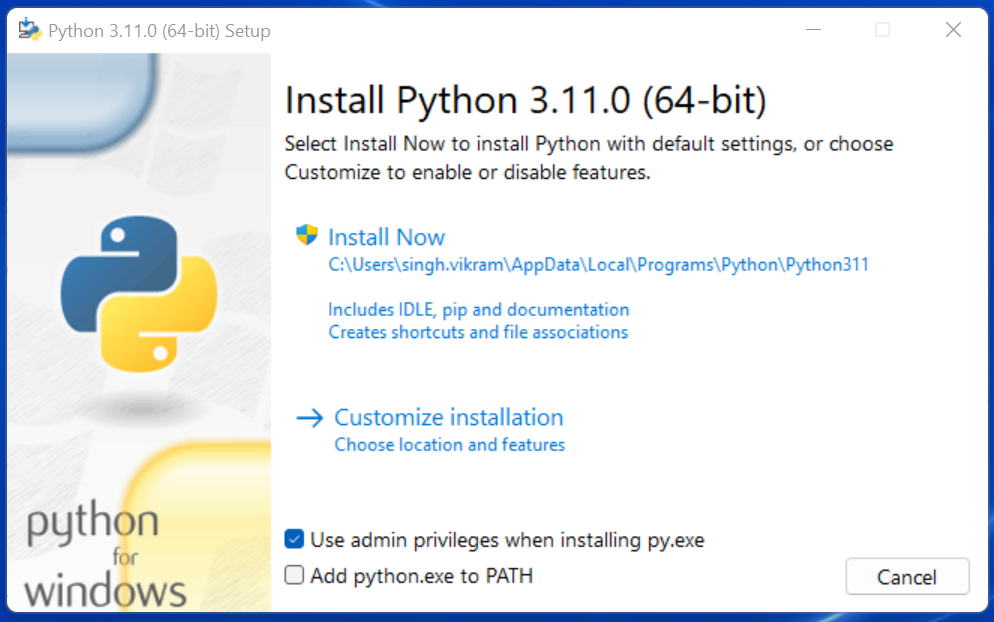

# Python Kurulumu

### Windows Kullanıcıları

Windows sürümlerinin hiçbirinde Python kurulu olarak gelmez. O yüzden Windows kullanıcıları, Python’ı sitesinden indirip kurmalıdır.

Bunun için öncelikle [https://www.python.org/downloads/](https://www.python.org/downloads/) adresine gidiyoruz.

_Not: Eğer indireceğiniz Python sürümünün mimarisini ve sürümünü kendiniz seçmek isterseniz_ [_https://www.python.org/ftp/python/_](https://www.python.org/ftp/python/) _adresinde ki arşivden kendinize uygun olan sürümü bulup indirebilirsiniz._

Bu adrese gittiğinizde, üzerinde ‘Download Python 3.11.0’ yazan bir düğme göreceksiniz. bu sürümü yada hali hazır da, güncel 3.x.x sürümünü yüklemeniz sizin python 3 sürümünü yüklediğiniz anlamına gelecektir.

Bu düğmeye tıklıyoruz. Bu düğmeye tıkladığınızda bilgisayarınıza _.exe_ uzantılı kurulum dosyası inecek. Bu dosyayı indirdikten sonra çift tıklayarak kurulum programını başlatabilirsiniz.

Kurulum dosyasına çift tıkladığınızda karşınıza ilk gelen ekranda, pencerenin alt tarafında şu kutucukları göreceksiniz:

> 1. **Use admin privileges when installing py.exe**
> 2. **Add Python.exe to PATH**

<figure><figcaption>
"Add python.exe to PATH" Seçeneğini işaretleyiniz.
</figcaption></figure>

Burada ilk kutucuk zaten seçilidir. Bunu bu şekilde bırakabilirsiniz. İkinci kutucuk ise Python’ı yola eklememizi, böylece yalnızca `python` komutu vererek Python’ı başlatabilmemizi sağlayacak. O yüzden oradaki ikinci kutucuğu da işaretliyoruz.

Aynı pencerenin üst tarafında ise şu seçenekleri göreceksiniz:

> 1. \-> **Install Now**
> 2. \-> **Customize Installation**

Burada ‘Install Now’ yazan kısma tıklayarak kurulumu başlatıyoruz.

Eğer Python’ın bilgisayarda nereye kurulacağını ve başka birtakım kurulum özelliklerini değiştirmek istiyorsanız ‘Customize Installation’ yazılı kısma tıklayabilirsiniz. Ben bu kılavuzda sizin ‘Install Now’ yazan kısma tıklayarak kurulum yaptığınızı varsayacağım.

### Windows için "CMD" kullanarak python sürüm kontrolü:

Python kurulumunu yaptık. Şimdi sağlamasını yapalım ve yüklediğimiz python sürümünü sorgulayalım.&#x20;

* Öncelikle **`Windows + R`** tuş kombinasyonuna basarak “**Çalıştır**” penceresini açalım.
* Çalıştır uygulamasında gerekli alana “**`CMD`**” yazarak “**Enter**” tuşuna basalım.
* Bu işlemlerden sonra karsımıza çıkacak konsol ekranına “**`python --V`**” veya “**`python --version`**” yazarak bilgisayarımızda herhangi bir python sürümünün **mevcut olup olmadığını** kontrol edebilirsiniz.

<figure><figcaption>
Yüklü sürüm bilgisi gösterilir.
</figcaption></figure>

### Python Kurulum ve Çalışma Dizini

Python programlama dilini, kullandığımız işletim sistemine nasıl kurabileceğimizi bilmek kadar önemli bir konu da Python’ı hangi dizine kurduğumuzu bilmektir. Zira programcılık maceramız boyunca karşılaşacağımız bazı sorunlar, Python’ın kurulu olduğu dizine gitmemizi gerektirecek, üstelik kendi yazdığımız bazı programlarda da Python’ın kurulu olduğu dizinde çeşitli işlemler yapmak ihtiyacı duyacağız. Ayrıca bazı durumlarda, o anda çalışan Python sürümünün hangi konumdan çalıştığını tespit etmemiz de gerekebilir.

İşte bu sebeplerden, Python’ın hangi dizine kurulduğunu mutlaka biliyor olmamız lazım.

Python’ın, işletim sisteminizde hangi dizine kurulduğu, Python’ı nasıl kurduğunuza bağlı olarak farklılık gösterir.

GNU/Linux dağıtımlarında Python genellikle _/usr/lib/python3.7_ dizininde kurulur. Ama elbette, eğer siz Python’ı kaynaktan derlediyseniz, derleme sırasında _configure_ betiğine verdiğiniz _–prefix_ parametresi yardımıyla Python’ın kurulum dizinini kendiniz de belirlemiş olabilirsiniz.

Windows’ta Python programlama dilini aynen bu kitapta gösterdiğimiz şekilde kurduysanız, Python `%LOCALAPPDATA%\Programs\Python` dizini içine kurulacaktır. Ancak eğer kurulum penceresinde ‘Customize Installation’ düğmesine basarak kurulumu özelleştirdiyseniz ve ‘Install for all users’ seçeneğini işaretlediyseniz Python _%PROGRAMFILES%_ veya _%PROGRAMFILES(x86)_ adlı çevre değişkenlerinin işaret ettiği dizin içine kurulacaktır.
